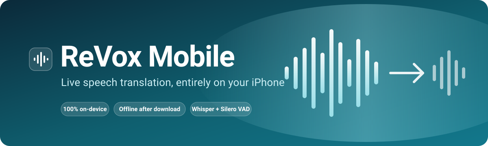
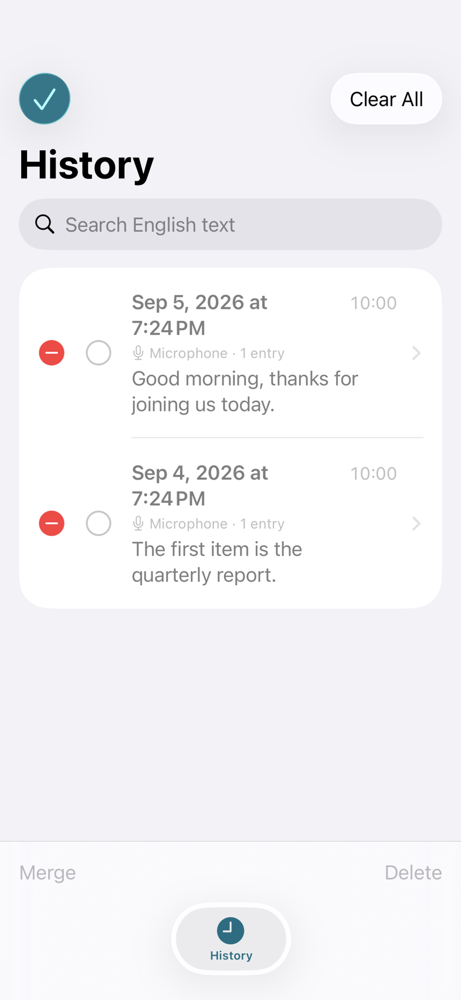
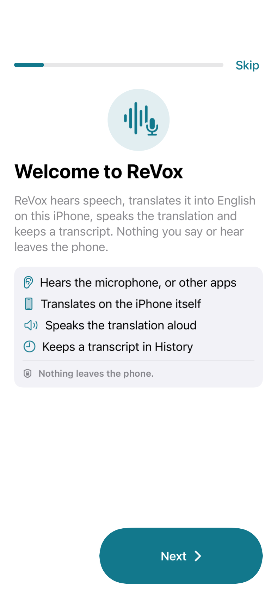
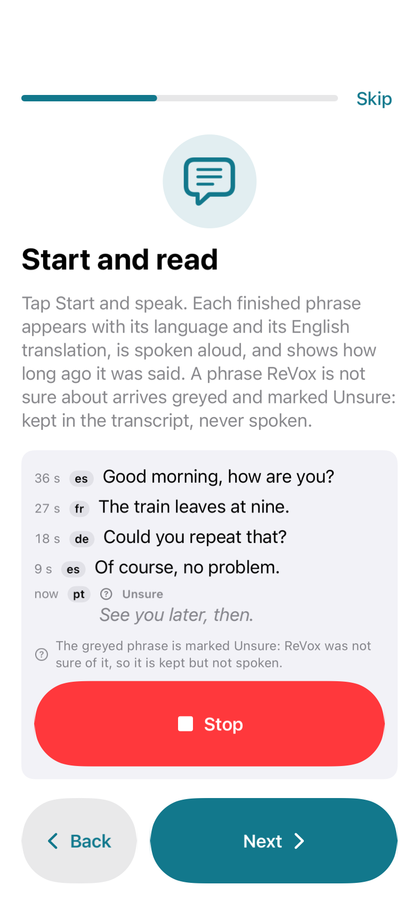
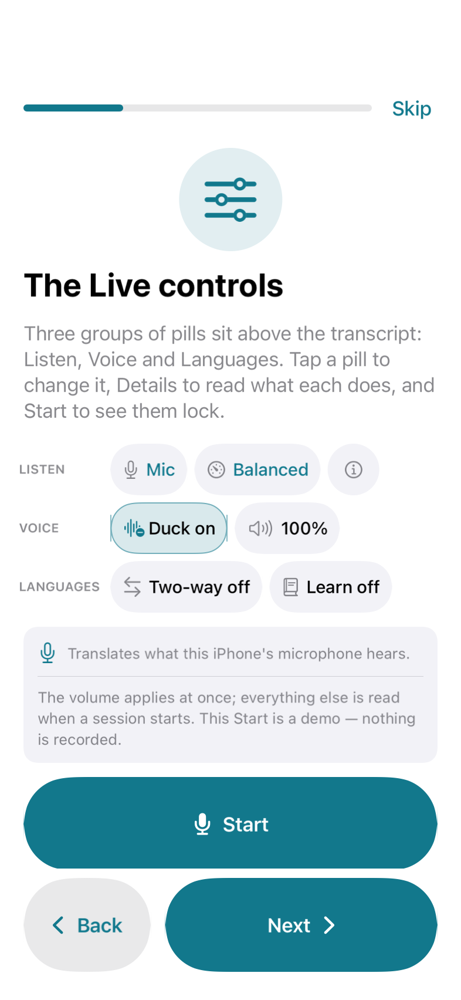
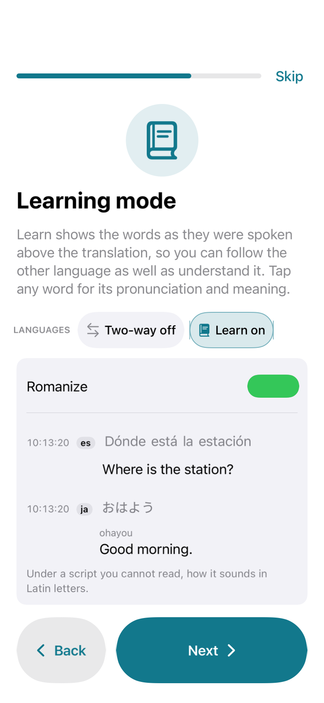
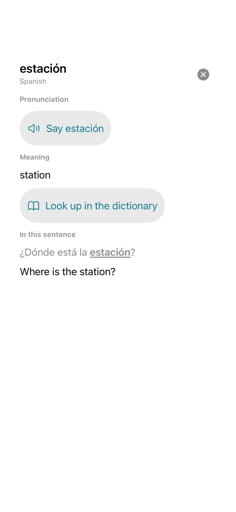
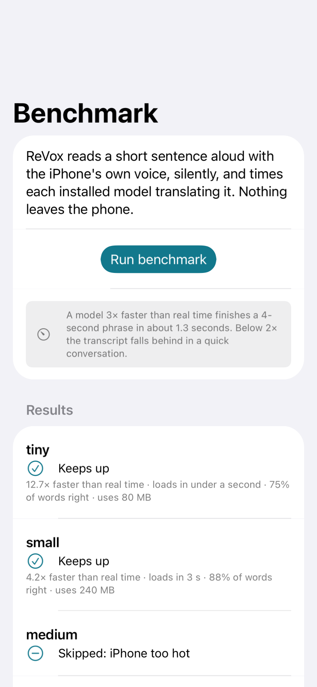
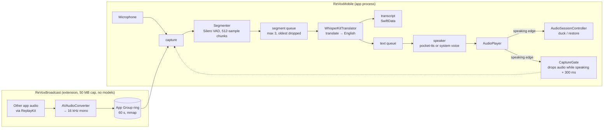

<div align="center">



<br>

**Listen to a room or another app, hear it in English, keep the transcript — with nothing leaving the phone.**

[](https://github.com/mchrisgm/ReVoxMobile/actions/workflows/ci.yml)
[](https://github.com/mchrisgm/ReVoxMobile/actions/workflows/testflight.yml)
[](#quick-start)
[](#for-developers)
[](#why-revox)
[](LICENSE)

[Quick start](#quick-start) · [How it works](#how-it-works) · [Using ReVox](#using-revox) · [Design decisions](#design-decisions) · [Architecture](#architecture) · [Roadmap](#roadmap) · [Contributing](#contributing)

</div>

---

ReVox Mobile is the iPhone version of [ReVox](https://github.com/mchrisgm/ReVox). It listens to audio — the microphone, or other apps through a screen-broadcast extension — cuts it into phrases with Silero VAD, translates each phrase to English on-device with Whisper via WhisperKit, speaks the English aloud, and keeps a searchable transcript of everything it heard. After the one-time model download it works fully offline: no audio, text or usage data ever leaves the phone.

## Why ReVox

Live translation usually means sending audio to a server. ReVox does not have one. Every model — the Silero voice detector, the Whisper model you choose, the optional pocket-tts voice — is downloaded once and then runs on the iPhone's own silicon, so a conversation across a table, a call in another app or a video you are watching is translated where it is heard. There is no account, no analytics and no telemetry; the only hosts ReVox ever contacts, and only while you start a download, are `huggingface.co` and its CDN. Since milestone 8 it also talks back: with **Two-way** on, what you say is spoken to the other person in their language, and the language you speak is neither translated nor spoken back at you.

## What it looks like

| | | |
|:---:|:---:|:---:|
|  |  |  |
| **Live, ready to start** — every control is a pill; the transcript gets the rest of the screen | **Live, translating** — the pills lock, and each phrase shows its language, translation and age | **Models** — five Whisper sizes, the recommendation for this iPhone, and what they will cost in space |
|  |  |  |
| **Voices** — the four pocket-tts voices with a sample, or any English system voice | **Settings** — every setting shows an example of what it does with its current value | **History** — search across sessions, then select several to merge or delete |
|  |  |  |
| **Tutorial, first page** — seven pages on the first launch, or from Settings any time | **Tutorial, the transcript** — a demo conversation types itself in and can be started and stopped | **Tutorial, the controls** — the real Live strip, so the first session looks like the tutorial |
|  |  |  |
| **Tutorial, Learning** — the words as spoken above each translation, tappable | **A word, tapped** — how it sounds, what it means, and the sentence it came from | **Benchmark this iPhone** — every installed model timed and scored on the phone in your hand |

<sub>Every screenshot here is rendered from the real screen by CI (`ScreenshotTests`), so they cannot drift from the app. See [ADR-0009](docs/adr/0009-screenshots-rendered-by-ci.md).</sub>

## How it works

Three stages, three tasks, one bounded and one unbounded hand-off — the same shape as the Windows pipeline. The capture task feeds the segmenter and the segment queue; the translate task drains the queue, applies the gates, writes the transcript and pushes English text; the speak task synthesises and enqueues clips. The player's speaking edge fans out to the ducking coordinator, the self-capture gate and the UI.



- **Segmenter.** Silero VAD scores every 512-sample chunk at 16 kHz; a phrase ends after the latency mode's silence (500 / 300 / 200 ms) or at its maximum length (10 / 4 / 3 s), with 200 ms of pre-roll. [Why ReVox drives the model itself →](docs/adr/0003-drive-silero-vad-ourselves.md)
- **Backpressure.** At most three phrases wait to be translated; older ones are dropped, the **Falling behind** badge appears and the transcript records `… (skipped: falling behind)`.
- **Gates.** Language detection (unless a source language is pinned) with a probability gate, then Whisper's no-speech and log-probability gates and a hallucination list — the Windows gates, ported one-to-one, with one deviation: a phrase the gates are unsure about is kept as a greyed, unspoken **Unsure** phrase instead of being dropped (row W8 of [the design spec](docs/superpowers/specs/2026-09-02-revox-mobile-design.md)).
- **Speaking.** The English is spoken by pocket-tts (once downloaded) or the iPhone's own voice; while it speaks, other apps are ducked and the capture gate drops what the microphone or the broadcast hears of ReVox's own voice.
- **Two-way.** The reply direction goes through Apple's on-device Translation framework (iOS 18) and an iOS voice for the target language. [ADR-0006](docs/adr/0006-whisper-translate-is-english-only.md), [ADR-0007](docs/adr/0007-pocket-tts-english-only-system-voice-for-replies.md)

## Quick start

### For users

ReVox Mobile is delivered through **TestFlight**. You need an iPhone 12 or newer running iOS 17 or later, and Wi-Fi for the first launch to download the Whisper model (and optionally the pocket-tts voice); nothing is downloaded after that. [docs/testing.md](docs/testing.md) walks through installing TestFlight, accepting an invitation, the first launch and how to send feedback. ReVox shows an interactive tutorial on first launch and can show it again from Settings — see [docs/onboarding.md](docs/onboarding.md).

### For developers

You need **Xcode 26 on macOS** and [XcodeGen](https://github.com/yonaskolb/XcodeGen) (`brew install xcodegen`). The `ReVoxCore` package needs no Xcode at all: it also builds and tests with the Swift 6.3 toolchain on Linux.

```bash
# Generate the project (it is never committed) and open it
xcodegen generate                 # writes ReVoxMobile.xcodeproj from project.yml
open ReVoxMobile.xcodeproj        # select the ReVoxMobile scheme, then build or run

# Or build and test on a simulator from the command line, the way CI does
xcodebuild test -project ReVoxMobile.xcodeproj -scheme ReVoxMobile \
  -destination "platform=iOS Simulator,name=iPhone 16" \
  -onlyUsePackageVersionsFromResolvedFile CODE_SIGNING_ALLOWED=NO

# The platform-independent package on its own (macOS or Linux)
cd ReVoxCore && swift test
```

<details>
<summary><strong>Build notes: package pins, bundle identifiers, signing</strong></summary>

- `ReVoxMobile.xcodeproj` is generated from `project.yml` and is never committed (it is ignored by `.gitignore`). Re-run `xcodegen generate` whenever `project.yml` changes or files are added.
- **Package pins.** `Package.resolved` at the repository root is the committed dependency graph — WhisperKit 1.1.0, FluidAudio 0.15.6 and everything they pull in. `xcodegen generate` copies it into the generated project (`options.postGenCommand`), and CI resolves and builds with `-onlyUsePackageVersionsFromResolvedFile`, so nobody silently gets a different version. To update a dependency on purpose: change `project.yml`, run `xcodebuild -resolvePackageDependencies -project ReVoxMobile.xcodeproj -scheme ReVoxMobile -clonedSourcePackagesDirPath .spm`, copy the result back with `cp ReVoxMobile.xcodeproj/project.xcworkspace/xcshareddata/swiftpm/Package.resolved Package.resolved`, and commit both files in the same pull request.
- `REVOX_BUNDLE_PREFIX` in `project.yml` (default `com.mchrisgm`) is the single place that defines every bundle identifier and the App Group: app `<prefix>.revox`, extension `<prefix>.revox.broadcast`, tests `<prefix>.revox.tests`, App Group `group.<prefix>.revox`. To build under your own team, override it on the command line (`xcodebuild ... REVOX_BUNDLE_PREFIX=com.example`) or set the `REVOX_BUNDLE_PREFIX` repository variable for CI; do not edit the ids anywhere else.
- **Signing.** Simulator builds need no signing. To run on a device you need a team: `project.yml` sets no `DEVELOPMENT_TEAM`, so either set your **Team** in **Signing & Capabilities** for both `ReVoxMobile` and `ReVoxBroadcast` in Xcode (and expect to do it again after every `xcodegen generate`, which discards that setting), or pass `DEVELOPMENT_TEAM=<team id> REVOX_BUNDLE_PREFIX=<your prefix>` to `xcodebuild`. The App Group `group.<prefix>.revox` must exist in your team; see step 1 of [docs/release.md](docs/release.md#one-time-apple-setup).

</details>

## Using ReVox

<details open>
<summary><strong>First run</strong></summary>

The first launch opens a short interactive tutorial: seven pages that host the real Live controls and a demo transcript typing itself in, and let you try the pills, Two-way with You speak and They speak, Learning with its tappable words, Romanize and the model choice without changing a setting. Skip it any time; **Settings › Show the tutorial** brings it back. [docs/onboarding.md](docs/onboarding.md) describes each page.

1. Open ReVox and go to **Settings › Models**. Tap **Download** next to a Whisper model. **Small** is the default and the right choice for most iPhones; the screen marks which models suit yours and warns about the ones that will be slow or hot. The voice detector downloads with your first model. Once a model is installed, **Settings › Models › Benchmark this iPhone** times every installed model on your phone and moves the recommendation to what it measured.
2. Keep ReVox open while the download runs — iOS stops the transfer when the app is suspended. A paused row resumes when you come back.
3. Optionally go to **Settings › Voices** and download a pocket-tts voice (*alba*, *azelma*, *cosette* or *javert*). Until you do, ReVox speaks with the iPhone's own voice, which needs no download.

</details>

<details>
<summary><strong>Translating</strong></summary>

The Live screen keeps its controls to three captioned rows of pills above the transcript — **Listen** (Mic or Other apps, the latency mode, and an ⓘ that unfolds what every pill does), **Voice** (ducking and the voice volume) and **Languages** (Two-way and Learning, with a **You speak** / **They speak** line beneath while Two-way is on) — so the transcript gets the screen. A pill's text says what it is set to; tap it to change it.

1. On the **Live** tab, choose what to listen to:
   - **Microphone** — whatever the iPhone's microphone hears: the room, the person across the table.
   - **Other apps** — a call, a video, anything playing on the iPhone. Tap **Start**, then start the broadcast from the picker ReVox shows (or from Control Center's **Screen Recording** control) and choose ReVox. Pressing the side button ends the broadcast.
2. Tap **Start**. The button shows a spinner and the model's own progress while it loads — the first load of a model takes a few seconds — then turns into a red **Stop**.
3. Speak, or start playing. Each finished phrase appears in the transcript with its detected language and its English translation, and is spoken aloud.
4. Tap **Stop** when you are done. The session is saved to **History**.

Every pill except the voice volume and the ⓘ is locked while a session runs, and a **Stop to change** line appears under the rows: ReVox reads them once, at Start. Stop and start again to change them.

</details>

<details>
<summary><strong>Two-way conversation</strong></summary>

By default ReVox translates everything it hears into English, including you. In a real conversation that is usually not what you want: what you say should not be echoed back at you in English, it should be spoken to the other person in *their* language. So the two languages are named by the two people — **You speak** and **They speak** — on the Live tab, in Settings and in the tutorial alike.

1. Tell ReVox the language you speak: **Settings › Your language › You speak** (the first row is **Not set**). From then on ReVox neither translates nor transcribes that language, and **Source language** must stay on **Auto-detect** for it to work — a pinned language is never detected, and the pill says so.
2. On the **Live** tab, turn on **Two-way** in the Languages row. A line appears beneath it with the pair: **You speak** (the same setting, so you can change it mid-conversation; it reads **Choose…** until it is set) and **They speak**, which shows **English** until you pick something else.
3. Choose the other person's language under **They speak**. Now both directions are live: what they say is translated to English and spoken to you, and what you say is transcribed and spoken to them in their language. The ⓘ panel spells it out — "What you say in English is spoken to them in Spanish; what they say is spoken to you in English." — and both sides appear in the transcript.

Two things to know about the reply direction:

- Whisper translates *into English only*, so the reply is produced by iOS's own on-device translator. That needs **iOS 18 or later**; on iOS 17, and on any language pair iOS cannot translate, the phrase is still transcribed — it is simply not spoken, and ReVox says so on the screen rather than falling silent without explanation.
- The reply is spoken by an iOS voice for that language (pocket-tts speaks English only). If your iPhone has no voice for the language under **They speak**, the pill shows a crossed speaker and the ⓘ panel says that what you say to them stays in the transcript; add one in **iOS Settings › Accessibility › Spoken Content › Voices**.

</details>

<details>
<summary><strong>While translating</strong></summary>

- **Quick controls** are the pills on the Live screen: Listen (the source and the latency mode), Voice (ducking and the voice volume) and Languages (Two-way and Learning). Volume changes at once; everything else is read at Start, so it locks while a session runs.
- **Mute** the voice with the speaker button in the navigation bar; the transcript keeps running.
- **Ducking** lowers other apps' audio while ReVox speaks. Turn it off in Settings or the quick controls; the change applies at the next Start.
- **Voice volume** sets how loud ReVox's own voice is.
- **Latency mode** trades responsiveness for context: *Balanced* (500 ms of silence ends a phrase, 10 s maximum), *Fast* (300 ms, 4 s) or *Very fast* (200 ms, 3 s — the quickest, with more and shorter phrases and more work for the model).
- **Learning** shows the words as they were spoken above the translation, so you can follow the other language as well as understand it. Each phrase is decoded a second time, so it takes a little longer to appear. Tap any word for its pronunciation and meaning: a small popover shows how it sounds in Latin letters, says it aloud (not while the microphone is listening, or ReVox would hear itself), gives its English meaning on iOS 18, offers **Look up in the dictionary** when the iPhone has a dictionary for that language, and shows the sentence with the word highlighted. Right-to-left languages show plain text for now. **Romanize** (Settings › Learning) adds how the whole original sounds in Latin letters under a script you cannot read; Japanese kana are right, kanji come out with their Chinese readings.
- **How long ago.** Each Live row shows how long ago the phrase was said — `12 s`, `3 min` — counting up as you read, which is easier to follow in a running conversation than the clock time. Settings › Time on the Live screen switches to the time, or both. History always shows the time.
- **Keep my model when hot** (Settings › Heat). When the iPhone gets hot, ReVox normally moves the next session to a smaller installed model and says so. Turn this on to keep your chosen model regardless. Translation still pauses at the iPhone's critical temperature, because iOS would otherwise close the app.
- If phrases arrive faster than they can be translated, ReVox keeps the newest three, shows **Falling behind** and marks the gap in the transcript.
- **Unsure phrases.** When ReVox is not sure of the language or the words — the language guess is weak, or the phrase scores between the log-probability gate and the noise floor — the phrase is not thrown away: it appears greyed, marked **Unsure** with a question-mark symbol and in italics, and is never spoken aloud. **Settings › Unsure phrases › Keep unsure phrases in History** (on by default) decides whether History and the exported file keep them too, marked `(unsure)`; off keeps them on the Live screen only. A change takes effect the next time you tap Start.
- Every setting in **Settings** shows an example of what it does with its current value — a sample transcript row, a timeline, a sentence — under the control.

</details>

<details>
<summary><strong>Afterwards</strong></summary>

The **History** tab lists every session, newest first, and searches across their English text. Open a session to read it in full, then **Share** it as a `.txt` file — the same format the Windows app writes — through Files, Mail or AirDrop. Swipe to delete a session; **Clear All** removes them all. Tap **Edit** to select several sessions and **Merge** them into one, in time order (the originals are removed), or **Delete** them together. Sessions older than 30 days are pruned automatically.

</details>

## Design decisions

The reasoning behind each decision lives in an Architecture Decision Record under [`docs/adr/`](docs/adr/). None of them invents a decision: each restates something already ruled in [the design spec](docs/superpowers/specs/2026-09-02-revox-mobile-design.md), a workflow or a doc, and cites it.

| ADR | Decision | In one line |
|---|---|---|
| [0001](docs/adr/0001-foundation-only-core-package.md) | Foundation-only core package | The pipeline is a one-to-one port whose 193 tests run on Linux and on the simulator, so both Foundations are verified on every push. |
| [0002](docs/adr/0002-ci-is-the-compiler.md) | CI is the compiler | There is no Xcode where ReVox is written; app targets are syntax-checked locally and compiled by the simulator job, with Python gates catching what `swiftc -parse` cannot. |
| [0003](docs/adr/0003-drive-silero-vad-ourselves.md) | Drive Silero VAD ourselves | FluidAudio's `VadManager` scores 4 096-sample chunks; Windows decides on every 512, so ReVox feeds the Core ML export directly. |
| [0004](docs/adr/0004-ducking-via-session-options.md) | Ducking via session options | iOS cannot set another app's volume; `.duckOthers` is added to and removed from the active session's options, never by deactivating it. |
| [0005](docs/adr/0005-broadcast-extension-ring-bridge.md) | Broadcast extension ring bridge | The extension stays under its 50 MB cap by forwarding 16 kHz audio into a 60 s App Group ring and doing nothing else — enforced by a CI gate. |
| [0006](docs/adr/0006-whisper-translate-is-english-only.md) | Whisper translates into English only | The reply direction uses Apple's Translation framework, iOS 18, weak-linked so iOS 17 still launches. |
| [0007](docs/adr/0007-pocket-tts-english-only-system-voice-for-replies.md) | pocket-tts is English; replies use a system voice | The system voice is the default and the fallback; a non-English phrase goes to an iOS voice for that language. |
| [0008](docs/adr/0008-testflight-on-every-merge.md) | TestFlight on every merge | Each merge to `main` ships a build; the macOS cost is the reason the trigger names `main` and nothing else. |
| [0009](docs/adr/0009-screenshots-rendered-by-ci.md) | Screenshots rendered by CI | `ScreenshotTests` renders every README image from the real views; the simulator job uploads them. |

## Architecture

Three Xcode targets plus one Swift package:

| Unit | Kind | What it owns |
|---|---|---|
| **`ReVoxMobile`** | iOS application (SwiftUI) | The user interface, the audio session and engine, the downloaded models, the translation pipeline's adapters, SwiftData storage. Everything with a model in it runs here. |
| **`ReVoxBroadcast`** | Broadcast Upload Extension (`com.apple.broadcast-services-upload`) | Receives other apps' audio during a system screen broadcast and hands it to the app through the shared App Group. It runs under a **50 MB memory cap**, so it only forwards audio: format detection, one `AVAudioConverter`, `memcpy` into the ring, Darwin notifications, a state record — and nothing else, ever. |
| **`ReVoxMobileTests`** | XCTest bundle | Adapter and screen tests hosted by the app, run on an iPhone simulator in CI without models or network. |
| **`ReVoxCore`** | Local Swift package, Foundation only | The platform-independent pipeline pieces — segmenter, gates, queues, transcript format, catalog, settings, ring-bridge types — so the same tests run on Linux and on the simulator. |

Data flow through the pipeline:

```
capture → Segmenter → segment queue (max 3) → WhisperKitTranslator → transcript + text queue → speaker → AudioPlayer → speaking edge → AudioSessionController
```

**What runs where.** In the app: VAD (a Core ML wrapper), Whisper (WhisperKit), pocket-tts (FluidAudio), `AVSpeechSynthesizer`, the audio engine, the audio session, SwiftData, downloads. In the extension: format detection, one converter, the ring write, Darwin notifications, a `UserDefaults(suiteName:)` record. In the core: everything that has a Windows counterpart plus the ring bridge types, with no I/O beyond the byte-level ring accessors it is handed. The full contract between the extension and the app — the ring file, its header, the ordering rules and the attach decision table — is [docs/broadcast-bridge.md](docs/broadcast-bridge.md), and CI fails if that document disagrees with the code.

**Why ReVox drives Silero VAD itself.** ReVox uses FluidAudio to download the Silero voice-detector model and to run pocket-tts, but not FluidAudio's `VadManager` for voice detection: that API scores 4 096-sample chunks and combines them, while the Windows version of ReVox — which this app ports one-to-one — decides speech on every 512-sample chunk with a threshold of 0.5, 200 ms of pre-roll and its silence and maximum-length rules. To keep the segmentation identical, ReVox loads FluidAudio's 512-sample Core ML export directly and feeds it chunk by chunk, keeping the model's recurrent state between chunks exactly as the Windows version does.

## Tech stack

| Component | What ReVox uses it for | Version / source |
|---|---|---|
| [WhisperKit](https://github.com/argmaxinc/WhisperKit) | Whisper on Core ML: language detection and the `translate` task, one decode at temperature 0 | `1.1.0`, pinned in `project.yml` and `Package.resolved` |
| [FluidAudio](https://github.com/FluidInference/FluidAudio) | Downloading the Silero export and running pocket-tts | `0.15.6`, pinned |
| [pocket-tts](https://huggingface.co/FluidInference/pocket-tts-coreml) by [Kyutai](https://kyutai.org) | ReVox's English voice (alba, azelma, cosette, javert), downloaded on demand | Core ML weights, `v2.1/english` |
| [Silero VAD](https://github.com/snakers4/silero-vad) | Cutting audio into phrases, 512 samples at a time | FluidAudio's `silero-vad-unified-v6.0.0` Core ML export |
| Whisper models | tiny, base, small, medium, large-v3 | Argmax's Core ML variants, downloaded at pinned commit revisions |
| Apple `Translation` framework | The reply direction of a two-way conversation | iOS 18, weak-linked |
| SwiftUI · SwiftData · AVFoundation · ReplayKit · Core ML | Screens, transcripts, audio session and engine, broadcast capture, VAD inference | iOS 17 SDK, Swift 5 language mode, Xcode 26 |
| [XcodeGen](https://github.com/yonaskolb/XcodeGen) | Generates `ReVoxMobile.xcodeproj` from `project.yml` | — |
| Swift 6.3 toolchain on Linux | Building and testing `ReVoxCore` without a Mac | `swift:6.3-noble` container in CI |

## Roadmap

| # | Milestone | Status |
|---|-----------|--------|
| 0 | Bootstrap: project skeleton, `ReVoxCore` package, CI, TestFlight workflow, docs | Done |
| 1 | Design spec and implementation plan | Done |
| 2 | `ReVoxCore` port: Segmenter, SpeechGate, Pipeline, Transcript, Catalog, Settings, RingBuffer | Done |
| 3 | Microphone mode end to end, first TestFlight build | Done |
| 4 | pocket-tts, voices, ducking | Done |
| 5 | Other-apps capture via the broadcast extension | Done |
| 6 | History, export, About screen, HIG polish | Done |
| 7 | Hardening: storage accounting, recovery, thermal and memory pressure | Done |
| 8 | Two-way conversation, the skipped language, Live screen polish, screenshots | Done |
| 9 | Keep my model when hot, quick controls, Very fast, merging sessions, Learning mode, how-long-ago, setting examples, the pocket-tts click | Done |
| 10 | UI compaction, full review, README, first-run tutorial | Done |
| 11 | Grouped Live controls, You speak / They speak, tappable words, unsure phrases, the History bar, on-device benchmark, tutorial refresh | **Current** |

Milestone 9 was the owner's second round of fixes and improvements: the model stays through a hot iPhone when asked, the settings a conversation reaches for sit on the Live screen, sessions merge in History, Learning mode shows the words as spoken (and how they sound), rows say how long ago rather than when, every setting shows an example, the selected model is highlighted as a whole row, and the click before every pocket-tts phrase is gated out of the clip.

Milestone 11 is the owner's third round: the Live pills sit in three captioned rows, the two-way pair is named by the two people, a word in Learning mode opens its pronunciation and meaning, a phrase ReVox is unsure about stays greyed instead of vanishing, the Merge / Delete bar sits above the tab bar, **Benchmark this iPhone** measures the models on the phone in your hand, and the tutorial hosts the real controls.

What each milestone was measured to do on real devices is recorded row by row in [`docs/measurements/`](docs/measurements/); a row that has not yet been measured on an iPhone says `pending`, and this README says "pending device measurement" wherever it leans on one.

## Platform limitations

These are iOS rules, not bugs, and they make the iPhone app behave differently from the Windows version. The About screen links here.

1. **Ducking.** iOS cannot set another app's volume. ReVox uses the `AVAudioSession` option `.duckOthers`; iOS chooses the amount and the ramp. The Windows ducked-level slider has no iOS equivalent; the Voice volume slider adjusts ReVox's own voice only. Ducking is applied and released by changing the session's options, never by deactivating it: deactivating would require pausing the engine, and a paused engine captures no microphone audio — a gap after every spoken phrase. Because ReVox's session mixes with others rather than interrupting them, dropping the `.duckOthers` option is what ends the duck. The fallback that does deactivate is still in the code behind one constant, in case a future iOS needs it; see [docs/measurements/m4-pocket-tts-ducking.md](docs/measurements/m4-pocket-tts-ducking.md) (the per-edge outcome is pending device measurement) and [ADR-0004](docs/adr/0004-ducking-via-session-options.md).
2. **Broadcast start.** Other apps' audio requires a user-started system broadcast: the picker in ReVox or Control Center's Screen Recording control. ReVox cannot start or stop it programmatically; pressing the side button ends it; some players (AVPlayer-based apps, Safari, Music) deliver silence to broadcasts.
3. **Extension memory.** The broadcast extension has a 50 MB cap; it only forwards audio, and every model runs in the app. A Control Center broadcast started while ReVox is closed is buffered for at most 60 s.
4. **Background.** Translation continues under the `audio` background mode while the audio session and engine run; the app must be started from the foreground first. iOS may still suspend the app under memory pressure, in which case the transcript shows a gap. The audio session and engine configuration that keeps a session alive in the background was measured and is recorded in [docs/broadcast-bridge.md](docs/broadcast-bridge.md).
5. **Self-capture.** In broadcast mode the extension also hears ReVox's English voice; the timing gate drops audio while ReVox speaks and for 300 ms after, so speech that overlaps ReVox's voice is not translated.
6. **The second direction.** Whisper's translate task produces English and nothing else, so translating *out of* English — the reply half of a two-way conversation — uses Apple's on-device `Translation` framework, which is iOS 18 and later. On iOS 17, and for any pair iOS has no model for, the phrase is transcribed in the language it was spoken in and not spoken back; the Live screen says which. Replies are spoken by an iOS voice for the target language, because pocket-tts speaks English only.
7. **Heat and battery.** Every model can be downloaded on every supported iPhone. Until you run the benchmark ReVox recommends by memory size: small by default (base below 4 GB); medium is in the suitable set from 6 GB, large-v3 from 8 GB; on 8 GB devices both medium and large-v3 carry a "long load time and heat" warning. After **Benchmark this iPhone** it recommends the most accurate installed model that ran at least twice as fast as real time and loaded in under 10 s, and the Models screen says when it was measured; models outside the suitable set for this iPhone are labelled "Not recommended for this iPhone" but are never hidden.

## How ReVox handles failure

Nothing here needs a decision from you; the app says what it did and keeps translating whenever it can.

- **A model that will not load.** If the selected Whisper model cannot be loaded (missing or damaged files, a Core ML compile failure), ReVox loads the largest smaller model you have installed instead and says so: "Couldn't load small. Using base instead." Your selected model is not changed — fix it with a re-download in Models and the next run uses it again. With nothing smaller installed the banner reads "Couldn't load small. Re-download small in Models." and no translation starts; the app does not crash and never gets stuck in an error state.
- **The voice detector.** If the Silero voice detector cannot be loaded, ReVox cannot cut the audio into phrases, so it refuses to start and offers a re-download: "Voice detector failed to load. Re-download it in Models."
- **A failure in the middle of a session.** If a phrase fails to translate, ReVox unloads and reloads the Whisper model once and retries that phrase. If it fails again the session stops with a "Try again" banner and the transcript is saved.
- **The voice.** If pocket-tts fails to load or to speak, ReVox switches to the system voice for the rest of the session and shows it in the status line; the transcript keeps running. The Voices screen offers Retry.
- **Memory pressure.** On the first memory warning ReVox drops the pocket-tts models and speaks with the system voice ("Memory low: switched to the system voice"). If the pressure continues, or if the Whisper model fails right after a warning because iOS took it back, ReVox moves the session to a smaller installed model straight away ("Memory low: switched to base").
- **Heat.** At the `serious` thermal state ReVox switches to the next smaller installed model for the next session and says so ("iPhone is hot: translation reduced") — the session you are in keeps running on the model it already loaded, because reloading a model is exactly what a hot iPhone does not need. At `critical` it pauses translation ("iPhone is hot: translation paused") and resumes by itself once the iPhone cools down, back on your own model. A session you stopped yourself is never resumed automatically.
- **Falling behind, interruptions and gaps.** At most three phrases wait to be translated; older ones are dropped, the "Falling behind" badge appears and the transcript records `… (skipped: falling behind)`. Calls and other interruptions pause the audio engine and ReVox resumes when iOS allows it; if iOS suspends the app the transcript shows the gap.

What each of these was measured to do on real devices is recorded in [docs/measurements/m7-hardening.md](docs/measurements/m7-hardening.md); its rows are pending device measurement.

## Models and storage

- **Where they live.** Everything ReVox downloads goes to the app's own Application Support folder, is excluded from backups, and is removed with the app. The Models screen shows the measured size of every installed model, the total ReVox occupies and how much room is left ("ReVox models: 1.0 GB · Free: 12.3 GB"); models that are not installed show the catalog estimate ("≈ 487 MB").
- **Deleting.** Models and the pocket-tts voices can be deleted only while translation is stopped: the swipe action is hidden during a session and the footer says "Stop translation to delete models". Deleting always asks for confirmation, and deleting the model in use switches ReVox to the smallest one you still have.
- **Downloads.** ReVox needs about 25 % more free space than a model's size plus a reserve, and refuses a download with the exact numbers when there is not enough. Keep the app open while a download runs: iOS stops the transfer when the app is suspended, and ReVox shows the row as Paused and resumes when you come back.
- **Which files.** The Whisper models and their tokenizers are downloaded at pinned commit revisions, so the same version of ReVox always installs the same files. The Silero voice detector and the pocket-tts voices come from FluidAudio's `main` branch, which cannot be pinned, so ReVox records their file list at install and flags a later difference on the row ("Files changed since download — re-download to be sure") instead of using it silently.
- **Offline.** After the downloads finish, ReVox contacts no server at all. The only hosts it ever contacts, and only while you start a download, are `huggingface.co` and its CDN.

### Which model?

What to expect, from Argmax's published WhisperKit runs on iPhones — 10-minute files transcribed offline, so a speed factor rather than a per-phrase latency; iPhone 13 to iPhone 16 Pro, iOS 18 to 26, dashboard last updated 2025-10-17 — until your own benchmark replaces them:

| Model | Published speed (× real time, slowest to fastest iPhone) | Published word error rate (mean of two test sets) | Notes |
|---|---|---|---|
| tiny | 41–92× | ≈ 16–18 % | The quickest and the roughest. |
| base | 30–58× | ≈ 12–13 % | The recommendation below 4 GB. |
| small | 10–19× | ≈ 8.7–9.0 % | The default; flagged with a warning on the iPhone 12 family. |
| medium | not published | not published | No published iPhone run exists; the benchmark is the only number. |
| large-v3 (the 947 MB build ReVox installs) | 1.4–2.3× | ≈ 26–29 % on long recordings, 4.6–4.8 % on clean read speech | A15 and later; the slowest and hottest. |

Source: the WhisperKit Benchmarks dashboard on Hugging Face ([`argmaxinc/whisperkit-benchmarks`](https://huggingface.co/spaces/argmaxinc/whisperkit-benchmarks), `dashboard_data/performance_data.json` and `support_data.csv`); a warm load of an already-compiled model is under a second for small and one to two seconds for large-v3 in those runs, while the first load after an install compiles for the Neural Engine and takes longer. Short phrases in a live conversation carry a per-phrase overhead these batch figures do not show; **Benchmark this iPhone** measures that on your iPhone, and [docs/measurements/m11-model-benchmark.md](docs/measurements/m11-model-benchmark.md) carries the cited reference numbers as expectations, the recommendation thresholds, and the table the owner fills by pasting the app's shared text.

## Transcripts

Every session is stored on the iPhone (SwiftData, in the app's own container, never synced). The **History** tab lists sessions newest first with the time, source, duration, entry count and first English line; the search field filters by English text and shows the matching line per session; a session opens to its header (start time, source, model, voice, source language) and its entries in the Live row style. **Share** exports the session as a `.txt` in the same format as the Windows app — a `# ReVox session <timestamp>` header, then `[HH:MM:SS] [<lang>] ` and `  → <english>` per entry, with `… (skipped: falling behind)` markers — through the share sheet (Files, Mail, AirDrop). Since milestone 11 a phrase ReVox was unsure about is kept as well, while **Keep unsure phrases in History** is on: greyed and marked **Unsure** in the session, counted in the session's header ("1 unsure phrase"), never matched by the search, and exported with `(unsure) ` at the start of its English line. The original-language text is empty on both platforms; only the English translation is stored. Swipe a row to delete it; **Clear All** and the per-session **Delete** ask for confirmation. Exported files live in the app's temporary folder and are removed after a day.

## Delivery

- **CI on every push:** [`.github/workflows/ci.yml`](.github/workflows/ci.yml) runs `swift test` for `ReVoxCore` in a Linux container (job `core-linux`), runs the source and doc gates on a bare Ubuntu runner (job `source-checks`), and builds and tests the app and the extension on an iPhone simulator with Xcode 26 (job `ios-simulator`). The simulator job also renders this README's screenshots from the real screens and uploads them as an artifact; `scripts/ci/collect-screenshots.sh` copies them out of the simulator's app container.
- **TestFlight on every merge to `main`:** [`.github/workflows/testflight.yml`](.github/workflows/testflight.yml) runs the tests, archives, exports and uploads the build to App Store Connect (jobs `preflight` and `upload`). It also runs on a `v*` tag and on demand from the **Actions** tab, where you can choose the signing path. A macOS runner bills at ten times the minute rate, so this is affordable at milestone-sized merges and would not be at per-push frequency — the trigger is `main` only. Until the Apple secrets are configured the upload is skipped with a notice and the workflow stays green. [ADR-0008](docs/adr/0008-testflight-on-every-merge.md)
- [docs/release.md](docs/release.md): one-time Apple setup, GitHub secrets, signing paths and troubleshooting for the repository owner.
- [docs/testing.md](docs/testing.md): how to install and try the app through TestFlight, for testers.

## Testing

As of the last green run: **`ReVoxCore` — 318 tests**, run twice, on Linux and on the simulator; **app and extension — 635 tests, 3 skipped** (the skipped ones are device-only measurements that a simulator cannot make). No test downloads anything or needs a model: every adapter is built behind a protocol from `ReVoxCore` and tested with injected fakes, and the core tests mirror the Windows tests one-to-one, backpressure and drop-marker cases included.

Beyond the test suites, CI runs gates that fail the build on a class of mistake rather than an instance: every ported constant must be asserted by name and value; no host-time API may appear in ReVox's sources or the resolved package checkouts; the extension may not contain models, an engine, a session, network, concurrency or dispatch; `docs/broadcast-bridge.md` must match `RingHeader.Offset`; the Info.plists, privacy manifests and entitlements must be complete; and `Package.resolved` must not have drifted. [CONTRIBUTING.md](CONTRIBUTING.md) lists each gate and what it catches.

## Contributing

Read [CONTRIBUTING.md](CONTRIBUTING.md): how to build, how the core tests run on Linux, the gates in `scripts/dev` and `scripts/ci`, the commit prefixes and the milestone pull-request flow. Bug reports and feature requests have templates under [`.github/ISSUE_TEMPLATE/`](.github/ISSUE_TEMPLATE/).

## Licences

- ReVox Mobile: [MIT](LICENSE).
- [WhisperKit](https://github.com/argmaxinc/WhisperKit): MIT.
- [FluidAudio](https://github.com/FluidInference/FluidAudio): Apache-2.0.
- [pocket-tts Core ML weights](https://huggingface.co/FluidInference/pocket-tts-coreml): CC-BY-4.0 — pocket-tts by [Kyutai](https://kyutai.org).
- [Silero VAD](https://github.com/snakers4/silero-vad): MIT.
- [Whisper weights (OpenAI)](https://github.com/openai/whisper): MIT.

The same five third-party notices, with links, are shown on the app's About screen.
