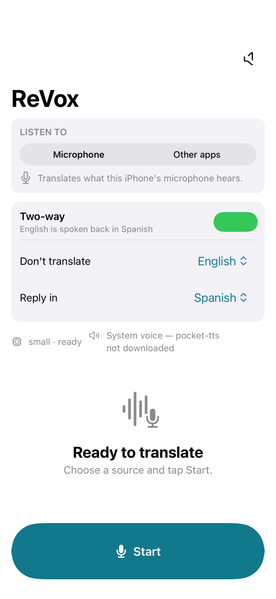
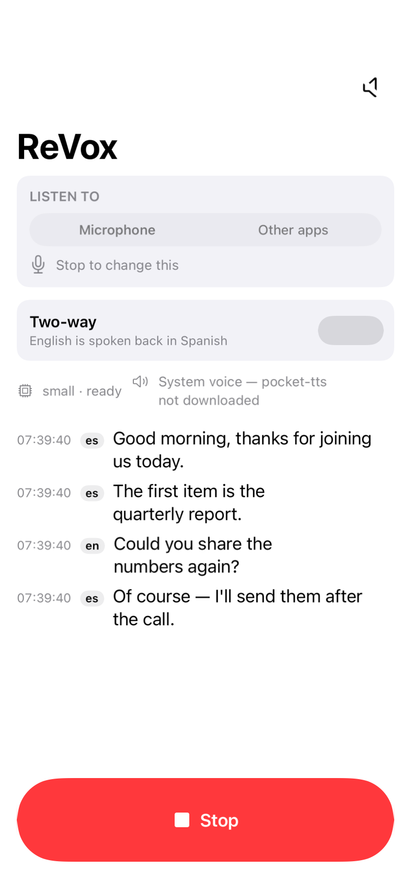
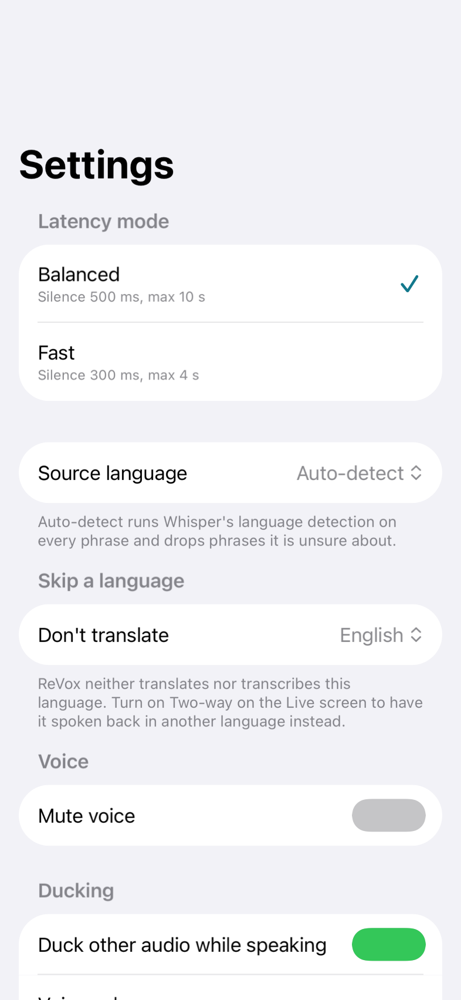
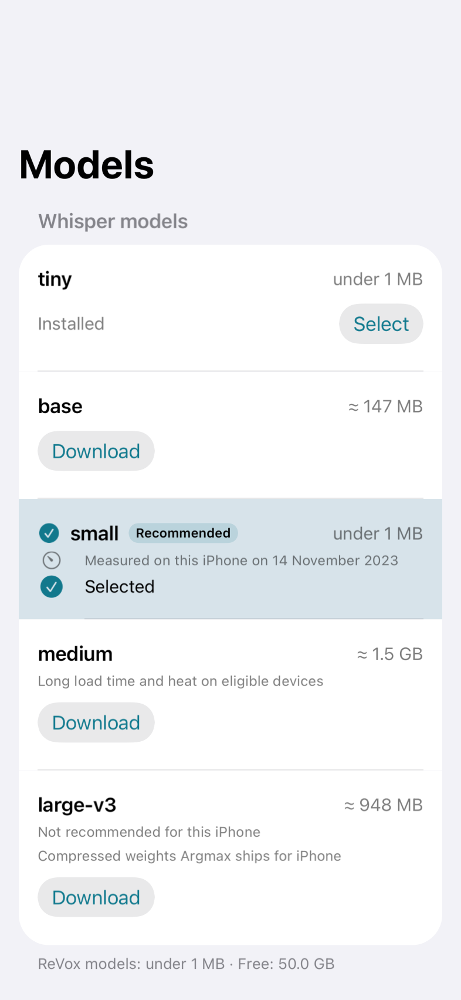
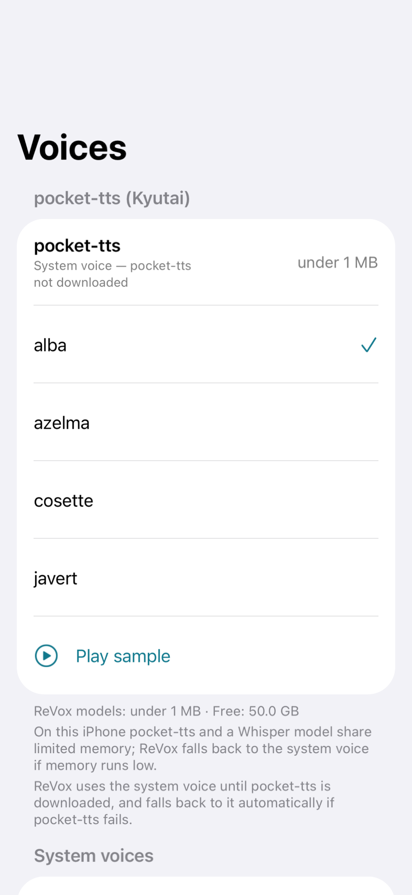

# ReVox Mobile

ReVox Mobile is the iPhone version of [ReVox](https://github.com/mchrisgm/ReVox). It listens to audio — the microphone, or other apps through a screen-broadcast extension — cuts it into phrases with Silero VAD, translates each phrase to English on-device with Whisper via WhisperKit, speaks the English aloud, and keeps a searchable transcript of everything it heard. After the one-time model download it works fully offline: no audio, text or usage data ever leaves the phone.

|  |  |  |
|---|---|---|
|  |  |  |
| Live, ready to start | Live, translating | Settings |

<sub>Every screenshot here is rendered from the real screen by CI (`ScreenshotTests`), so they cannot drift from the app.</sub>

## Using ReVox

### First run

1. Open ReVox and go to **Settings › Models**. Tap **Download** next to a Whisper model. **Small** is the default and the right choice for most iPhones; the screen marks which models suit yours and warns about the ones that will be slow or hot. The voice detector downloads with your first model.
2. Keep ReVox open while the download runs — iOS stops the transfer when the app is suspended. A paused row resumes when you come back.
3. Optionally go to **Settings › Voices** and download a pocket-tts voice (*alba*, *azelma*, *cosette* or *javert*). Until you do, ReVox speaks with the iPhone's own voice, which needs no download.

### Translating

1. On the **Live** tab, choose what to listen to:
   - **Microphone** — whatever the iPhone's microphone hears: the room, the person across the table.
   - **Other apps** — a call, a video, anything playing on the iPhone. Tap **Start**, then start the broadcast from the picker ReVox shows (or from Control Center's **Screen Recording** control) and choose ReVox. Pressing the side button ends the broadcast.
2. Tap **Start**. The button shows a spinner and the model's own progress while it loads — the first load of a model takes a few seconds — then turns into a red **Stop**.
3. Speak, or start playing. Each finished phrase appears in the transcript with its detected language and its English translation, and is spoken aloud.
4. Tap **Stop** when you are done. The session is saved to **History**.

The source and the two-way controls are locked while a session runs: ReVox reads them once, at Start. Stop and start again to change them.

### Two-way conversation

By default ReVox translates everything it hears into English, including you. In a real conversation that is usually not what you want: your own language should be left alone, and what you say should be spoken back to the other person in *their* language.

1. In **Settings › Skip a language**, choose the language ReVox should leave alone — normally your own. From then on ReVox neither translates nor transcribes it, and **Source language** must stay on **Auto-detect** for it to work (a pinned language is never detected).
2. On the **Live** tab, turn on **Two-way**. Two pickers appear: **Don't translate** (the same setting, so you can change it mid-conversation) and **Reply in**.
3. Choose the other person's language under **Reply in**. Now both directions are live: their language is translated to English and spoken to you, and yours is transcribed and spoken back to them in the language you chose. Both sides appear in the transcript.

Two things to know about the reply direction:

- Whisper translates *into English only*, so the reply is produced by iOS's own on-device translator. That needs **iOS 18 or later**; on iOS 17, and on any language pair iOS cannot translate, the phrase is still transcribed — it is simply not spoken, and ReVox says so on the screen rather than falling silent without explanation.
- The reply is spoken by an iOS voice for that language (pocket-tts speaks English only). If your iPhone has no voice for the language you picked, ReVox tells you while you are picking it; add one in **iOS Settings › Accessibility › Spoken Content › Voices**.

### While translating

- **Quick controls** sit on the Live screen under the two-way card: latency mode, ducking, Learning and the voice volume. Volume changes at once; the other three are read at Start, so they lock while a session runs.
- **Mute** the voice with the speaker button in the navigation bar; the transcript keeps running.
- **Ducking** lowers other apps' audio while ReVox speaks. Turn it off in Settings or the quick controls; the change applies at the next Start.
- **Voice volume** sets how loud ReVox's own voice is.
- **Latency mode** trades responsiveness for context: *Balanced* (500 ms of silence ends a phrase, 10 s maximum), *Fast* (300 ms, 4 s) or *Very fast* (200 ms, 3 s — the quickest, with more and shorter phrases and more work for the model).
- **Learning** shows the words as they were spoken above the translation, so you can follow the other language as well as understand it. Each phrase is decoded a second time, so it takes a little longer to appear. **Romanize** (Settings › Learning) adds how the original sounds in Latin letters under a script you cannot read; Japanese kana are right, kanji come out with their Chinese readings.
- **How long ago.** Each Live row shows how long ago the phrase was said — `12 s`, `3 min` — counting up as you read, which is easier to follow in a running conversation than the clock time. Settings › Time on the Live screen switches to the time, or both. History always shows the time.
- **Keep my model when hot** (Settings › Heat). When the iPhone gets hot, ReVox normally moves the next session to a smaller installed model and says so. Turn this on to keep your chosen model regardless. Translation still pauses at the iPhone's critical temperature, because iOS would otherwise close the app.
- If phrases arrive faster than they can be translated, ReVox keeps the newest three, shows **Falling behind** and marks the gap in the transcript.
- Every setting in **Settings** shows an example of what it does with its current value — a sample transcript row, a timeline, a sentence — under the control.

### Afterwards

The **History** tab lists every session, newest first, and searches across their English text. Open a session to read it in full, then **Share** it as a `.txt` file — the same format the Windows app writes — through Files, Mail or AirDrop. Swipe to delete a session; **Clear All** removes them all. Tap **Edit** to select several sessions and **Merge** them into one, in time order (the originals are removed), or **Delete** them together. Sessions older than 30 days are pruned automatically.

## Status


| # | Milestone | Status |
|---|-----------|--------|
| 0 | Bootstrap: project skeleton, `ReVoxCore` package, CI, TestFlight workflow, docs | Done |
| 1 | Design spec and implementation plan | Done |
| 2 | `ReVoxCore` port: Segmenter, SpeechGate, Pipeline, Transcript, Catalog, Settings, RingBuffer | Done |
| 3 | Microphone mode end to end, first TestFlight build | Done |
| 4 | pocket-tts, voices, ducking | Done |
| 5 | Other-apps capture via the broadcast extension | Done |
| 6 | History, export, About screen, HIG polish | Done |
| 7 | Hardening: storage accounting, recovery, thermal and memory pressure | Done |
| 8 | Two-way conversation, the skipped language, Live screen polish, screenshots | Done |
| 9 | Keep my model when hot, quick controls, Very fast, merging sessions, Learning mode, how-long-ago, setting examples, the pocket-tts click | **Current** |

Milestone 9 is the owner's second round of fixes and improvements: the model stays through a hot iPhone when asked, the settings a conversation reaches for sit on the Live screen, sessions merge in History, Learning mode shows the words as spoken (and how they sound), rows say how long ago rather than when, every setting shows an example, the selected model is highlighted as a whole row, and the click before every pocket-tts phrase is gated out of the clip.

## Requirements

**To run the app**

- iPhone 12 or newer.
- iOS 17 or later.
- Wi-Fi for the first launch, to download the Whisper model (and optionally the pocket-tts voice). Nothing is downloaded after that.

**To build the app**

- Xcode 26 on macOS.
- [XcodeGen](https://github.com/yonaskolb/XcodeGen): `brew install xcodegen`.
- The `ReVoxCore` package needs no Xcode at all: it also builds and tests with the Swift 6.3 toolchain on Linux.

## Building

```bash
xcodegen generate                 # writes ReVoxMobile.xcodeproj from project.yml
open ReVoxMobile.xcodeproj        # select the ReVoxMobile scheme, then build or run
```

To build and test the platform-independent package on its own (macOS or Linux):

```bash
cd ReVoxCore && swift test
```

Notes:

- `ReVoxMobile.xcodeproj` is generated from `project.yml` and is never committed (it is ignored by `.gitignore`). Re-run `xcodegen generate` whenever `project.yml` changes or files are added.
- **Package pins.** `Package.resolved` at the repository root is the committed dependency graph — WhisperKit 1.1.0, FluidAudio 0.15.6 and everything they pull in. `xcodegen generate` copies it into the generated project (`options.postGenCommand`), and CI resolves and builds with `-onlyUsePackageVersionsFromResolvedFile`, so nobody silently gets a different version. To update a dependency on purpose: change `project.yml`, run `xcodebuild -resolvePackageDependencies -project ReVoxMobile.xcodeproj -scheme ReVoxMobile -clonedSourcePackagesDirPath .spm`, copy the result back with `cp ReVoxMobile.xcodeproj/project.xcworkspace/xcshareddata/swiftpm/Package.resolved Package.resolved`, and commit both files in the same pull request.
- `REVOX_BUNDLE_PREFIX` in `project.yml` (default `com.mchrisgm`) is the single place that defines every bundle identifier and the App Group: app `<prefix>.revox`, extension `<prefix>.revox.broadcast`, tests `<prefix>.revox.tests`, App Group `group.<prefix>.revox`. To build under your own team, override it on the command line (`xcodebuild ... REVOX_BUNDLE_PREFIX=com.example`) or set the `REVOX_BUNDLE_PREFIX` repository variable for CI; do not edit the ids anywhere else.
- **Signing.** Simulator builds need no signing. To run on a device you need a team: `project.yml` sets no `DEVELOPMENT_TEAM`, so either set your **Team** in **Signing & Capabilities** for both `ReVoxMobile` and `ReVoxBroadcast` in Xcode (and expect to do it again after every `xcodegen generate`, which discards that setting), or pass `DEVELOPMENT_TEAM=<team id> REVOX_BUNDLE_PREFIX=<your prefix>` to `xcodebuild`. The App Group `group.<prefix>.revox` must exist in your team; see step 1 of [docs/release.md](docs/release.md#one-time-apple-setup).

## Architecture

Three Xcode targets plus one Swift package:

- **`ReVoxMobile`** (application): the SwiftUI app that owns the user interface, the audio session, the downloaded models and the translation pipeline.
- **`ReVoxBroadcast`** (Broadcast Upload Extension, `com.apple.broadcast-services-upload`): receives other apps' audio during a system screen broadcast and hands it to the app through the shared App Group.
- **`ReVoxMobileTests`** (unit-test bundle): XCTest tests hosted by the app, run on an iPhone simulator in CI.
- **`ReVoxCore`** (local Swift package, Foundation only): the platform-independent pipeline pieces, so the same tests run on Linux and on the simulator.

Data flow through the pipeline:

```
capture → Segmenter → segment queue (max 3) → WhisperKitTranslator → transcript + text queue → speaker → AudioPlayer → speaking edge → AudioSessionController
```

**Why ReVox drives Silero VAD itself.** ReVox uses FluidAudio to download the Silero voice-detector model and to run pocket-tts, but not FluidAudio's `VadManager` for voice detection: that API scores 4 096-sample chunks and combines them, while the Windows version of ReVox — which this app ports one-to-one — decides speech on every 512-sample chunk with a threshold of 0.5, 200 ms of pre-roll and its silence and maximum-length rules. To keep the segmentation identical, ReVox loads FluidAudio's 512-sample Core ML export directly and feeds it chunk by chunk, keeping the model's recurrent state between chunks exactly as the Windows version does.

## Platform limitations

These are iOS rules, not bugs, and they make the iPhone app behave differently from the Windows version. The About screen links here.

1. **Ducking.** iOS cannot set another app's volume. ReVox uses the `AVAudioSession` option `.duckOthers`; iOS chooses the amount and the ramp. The Windows ducked-level slider has no iOS equivalent; the Voice volume slider adjusts ReVox's own voice only. Ducking is applied and released by changing the session's options, never by deactivating it: deactivating would require pausing the engine, and a paused engine captures no microphone audio — a gap after every spoken phrase. Because ReVox's session mixes with others rather than interrupting them, dropping the `.duckOthers` option is what ends the duck. The fallback that does deactivate is still in the code behind one constant, in case a future iOS needs it; see [docs/measurements/m4-pocket-tts-ducking.md](docs/measurements/m4-pocket-tts-ducking.md).
2. **Broadcast start.** Other apps' audio requires a user-started system broadcast: the picker in ReVox or Control Center's Screen Recording control. ReVox cannot start or stop it programmatically; pressing the side button ends it; some players (AVPlayer-based apps, Safari, Music) deliver silence to broadcasts.
3. **Extension memory.** The broadcast extension has a 50 MB cap; it only forwards audio, and every model runs in the app. A Control Center broadcast started while ReVox is closed is buffered for at most 60 s.
4. **Background.** Translation continues under the `audio` background mode while the audio session and engine run; the app must be started from the foreground first. iOS may still suspend the app under memory pressure, in which case the transcript shows a gap. The audio session and engine configuration that keeps a session alive in the background was measured and is recorded in [docs/broadcast-bridge.md](docs/broadcast-bridge.md).
5. **Self-capture.** In broadcast mode the extension also hears ReVox's English voice; the timing gate drops audio while ReVox speaks and for 300 ms after, so speech that overlaps ReVox's voice is not translated.
6. **The second direction.** Whisper's translate task produces English and nothing else, so translating *out of* English — the reply half of a two-way conversation — uses Apple's on-device `Translation` framework, which is iOS 18 and later. On iOS 17, and for any pair iOS has no model for, the phrase is transcribed in the language it was spoken in and not spoken back; the Live screen says which. Replies are spoken by an iOS voice for the target language, because pocket-tts speaks English only.
7. **Heat and battery.** Every model can be downloaded on every supported iPhone. ReVox recommends small by default (base below 4 GB); medium is in the suitable set from 6 GB, large-v3 from 8 GB; on 8 GB devices both medium and large-v3 carry a "long load time and heat" warning; models outside the suitable set for this iPhone are labelled "Not recommended for this iPhone" but are never hidden.

## How ReVox handles failure

Nothing here needs a decision from you; the app says what it did and keeps translating whenever it can.

- **A model that will not load.** If the selected Whisper model cannot be loaded (missing or damaged files, a Core ML compile failure), ReVox loads the largest smaller model you have installed instead and says so: "Couldn't load small. Using base instead." Your selected model is not changed — fix it with a re-download in Models and the next run uses it again. With nothing smaller installed the banner reads "Couldn't load small. Re-download small in Models." and no translation starts; the app does not crash and never gets stuck in an error state.
- **The voice detector.** If the Silero voice detector cannot be loaded, ReVox cannot cut the audio into phrases, so it refuses to start and offers a re-download: "Voice detector failed to load. Re-download it in Models."
- **A failure in the middle of a session.** If a phrase fails to translate, ReVox unloads and reloads the Whisper model once and retries that phrase. If it fails again the session stops with a "Try again" banner and the transcript is saved.
- **The voice.** If pocket-tts fails to load or to speak, ReVox switches to the system voice for the rest of the session and shows it in the status line; the transcript keeps running. The Voices screen offers Retry.
- **Memory pressure.** On the first memory warning ReVox drops the pocket-tts models and speaks with the system voice ("Memory low: switched to the system voice"). If the pressure continues, or if the Whisper model fails right after a warning because iOS took it back, ReVox moves the session to a smaller installed model straight away ("Memory low: switched to base").
- **Heat.** At the `serious` thermal state ReVox switches to the next smaller installed model for the next session and says so ("iPhone is hot: translation reduced") — the session you are in keeps running on the model it already loaded, because reloading a model is exactly what a hot iPhone does not need. At `critical` it pauses translation ("iPhone is hot: translation paused") and resumes by itself once the iPhone cools down, back on your own model. A session you stopped yourself is never resumed automatically.
- **Falling behind, interruptions and gaps.** At most three phrases wait to be translated; older ones are dropped, the "Falling behind" badge appears and the transcript records `… (skipped: falling behind)`. Calls and other interruptions pause the audio engine and ReVox resumes when iOS allows it; if iOS suspends the app the transcript shows the gap.

What each of these was measured to do on real devices is recorded in [docs/measurements/m7-hardening.md](docs/measurements/m7-hardening.md).

## Models and storage

|  |  |
|---|---|
|  |  |
| Models | Voices |

- **Where they live.** Everything ReVox downloads goes to the app's own Application Support folder, is excluded from backups, and is removed with the app. The Models screen shows the measured size of every installed model, the total ReVox occupies and how much room is left ("ReVox models: 1.0 GB · Free: 12.3 GB"); models that are not installed show the catalog estimate ("≈ 487 MB").
- **Deleting.** Models and the pocket-tts voices can be deleted only while translation is stopped: the swipe action is hidden during a session and the footer says "Stop translation to delete models". Deleting always asks for confirmation, and deleting the model in use switches ReVox to the smallest one you still have.
- **Downloads.** ReVox needs about 25 % more free space than a model's size plus a reserve, and refuses a download with the exact numbers when there is not enough. Keep the app open while a download runs: iOS stops the transfer when the app is suspended, and ReVox shows the row as Paused and resumes when you come back.
- **Which files.** The Whisper models and their tokenizers are downloaded at pinned commit revisions, so the same version of ReVox always installs the same files. The Silero voice detector and the pocket-tts voices come from FluidAudio's `main` branch, which cannot be pinned, so ReVox records their file list at install and flags a later difference on the row ("Files changed since download — re-download to be sure") instead of using it silently.
- **Offline.** After the downloads finish, ReVox contacts no server at all. The only hosts it ever contacts, and only while you start a download, are `huggingface.co` and its CDN.

## Transcripts

Every session is stored on the iPhone (SwiftData, in the app's own container, never synced). The **History** tab lists sessions newest first with the time, source, duration, entry count and first English line; the search field filters by English text and shows the matching line per session; a session opens to its header (start time, source, model, voice, source language) and its entries in the Live row style. **Share** exports the session as a `.txt` in the same format as the Windows app — a `# ReVox session <timestamp>` header, then `[HH:MM:SS] [<lang>] ` and `  → <english>` per entry, with `… (skipped: falling behind)` markers — through the share sheet (Files, Mail, AirDrop). The original-language text is empty on both platforms; only the English translation is stored. Swipe a row to delete it; **Clear All** and the per-session **Delete** ask for confirmation. Exported files live in the app's temporary folder and are removed after a day.

## Delivery

- **CI on every push:** [`.github/workflows/ci.yml`](.github/workflows/ci.yml) runs `swift test` for `ReVoxCore` in a Linux container (job `core-linux`) and builds and tests the app and the extension on an iPhone simulator with Xcode 26 (job `ios-simulator`). The simulator job also renders this README's screenshots from the real screens and uploads them as an artifact; `scripts/ci/collect-screenshots.sh` copies them out of the simulator's app container.
- **TestFlight on every merge to `main`:** [`.github/workflows/testflight.yml`](.github/workflows/testflight.yml) runs the tests, archives, exports and uploads the build to App Store Connect (jobs `preflight` and `upload`). It also runs on a `v*` tag and on demand from the **Actions** tab, where you can choose the signing path. A macOS runner bills at ten times the minute rate, so this is affordable at milestone-sized merges and would not be at per-push frequency — the trigger is `main` only. Until the Apple secrets are configured the upload is skipped with a notice and the workflow stays green.
- [docs/release.md](docs/release.md): one-time Apple setup, GitHub secrets, signing paths and troubleshooting for the repository owner.
- [docs/testing.md](docs/testing.md): how to install and try the app through TestFlight, for testers.

## Licences

- ReVox Mobile: [MIT](LICENSE).
- [WhisperKit](https://github.com/argmaxinc/WhisperKit): MIT.
- [FluidAudio](https://github.com/FluidInference/FluidAudio): Apache-2.0.
- [pocket-tts Core ML weights](https://huggingface.co/FluidInference/pocket-tts-coreml): CC-BY-4.0 — pocket-tts by [Kyutai](https://kyutai.org).
- [Silero VAD](https://github.com/snakers4/silero-vad): MIT.
- [Whisper weights (OpenAI)](https://github.com/openai/whisper): MIT.

The same five third-party notices, with links, are shown on the app's About screen.
